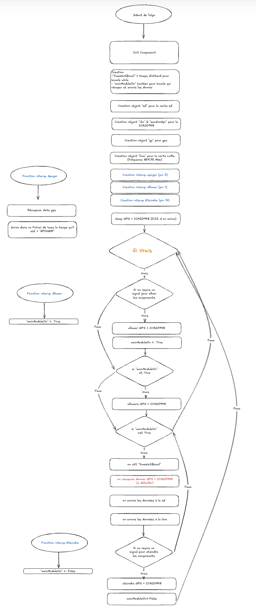

# **DOC Oignon - ODC**

## **Avant de toucher au payload**
1. [ ] Supprimer tous les éléments de test (dans le fichier de test) sur la board.
2. [ ] Vider la carte SD.
3. [ ] Lancer le `main.py`.

---

## **Composants**

- Carte PCB LoRa + SD
- Carte PCB GPS + ICM
- Carte SD 64G (verte)
- 1x Antenne GPS
- 2x Antenne LoRa
- 4x Connecteurs JST double alim
- 6x Connecteurs JST 4 pin
- Carte d’alimentation (Maître, en haut à droite selon le schéma de câblage)

---

## **Schéma et répartition du code**


### **Remarque**
Le câblage de la Raspberry Pi et des modules (en haut à droite) est inversé (rouge = négatif, noir = positif).


Deux fichiers : 
1. **Librairies compilées** (économie d'espace mémoire). `.mpi`
2. **Librairies en clair**. `.py`


### **Cartes liées :**
- **Séquenceur altimétrique** (toutes les LEDs de différentes couleurs)
  - USB B + LEDs + Buzzer
- **Liaison montante (Oignon Uplink)**
  - LoRa + Raspberry Pi
- **ICM + GPS**
  - 1 alim 2x + 1 JST 4x
- **LoRa + SD** 
  - 1 alim 2x + 3 JST 4x

---

## **Détails des composants**

### **Carte SD**
- **Protocole SPI** :
    - `spi_bus = 0`
    - `baudrate = 2000000` (même que LoRa)
    - `pinSck = 2`
    - `pinMiso = 4`
    - `pinMosi = 3`
    - `pinSC = 5`

#### **Fonctionnalités** :
- Essaye de reconnecter la SD si elle n'est pas ouverte.
- À chaque réouverture, crée un nouveau fichier "dataX.csv".
- Se reconnecte tous les 5 cycles en cas de déconnexion.
- Flushe les données toutes les 30 lignes (code ligne 107).

Si l'initialisation échoue : 
- Problème possible au niveau des pins, à vérifier dans le constructeur.
écrire le code si dessous dans constructeur il envéra plus de détail 

```python
self.sd = sdcard.SDCard(self.spi, machine.Pin(self.pinSC))
```

- La carte SD doit être formatée en FAT.(la 8g marche + souvant)

### **ICM**
- **Protocole I2C** :
    - `sda = Pin(6)`
    - `scl = Pin(7)`

#### **Paramétrage du composants** :
- Accéléromètre :
    ```python
    self.icm.accelerometer_range = icm20948.RANGE_8G
    self.icm.acc_dlpf_cutoff = icm20948.FREQ_246_0
    ```
    - Plage de détection maximale : ±8g.
    - Fréquence de coupure du filtre passe-bas : 246 Hz (forte vibration = filtration élevée).
    
- Gyroscope :
    ```python
    self.icm.gyro_full_scale = icm20948.FS_500_DPS
    self.icm.gyro_dlpf_cutoff = icm20948.G_FREQ_51_2
    ```
    - Rotation maximale : ±500 degrés par seconde.
    - Filtre passe-bas : coupure à 11,6 Hz (idem pour les vibrations).

- Lecture avec gestion d'erreurs (`try`), si erreur, tentative de reconnexion.

### **GPS**
- **Protocole UART** :
    - `rx = 9`
    - `tx = 8`

Fonction bloquante,mais même avec absence de fixation, elle continue de fonctionner sans provoquer d'erreurs (renvoie 0 si aucune donnée).

Récupération des données toutes les **0.2s** max.

### **LoRa SX**
- **Protocole SPI** :
    - `spi_bus = 0`
    - `clk = 2`
    - `mosi = 3`
    - `miso = 4`
    - `cs = 27`
    - `irq = 20`
    - `rst = 15`
    - `gpio = 26`

#### **Initialisation LoRa** :
- **Bande passante** :
    ```python
      lora.setup(869.75, bw=500, sf=12, cr=8, power=14)
    ```
    - Fréquence : 869.75 MHz
    - Spreading Factor : 12
    - Code Rate : 8
    - Power : 8
    - Bande passante : 500

- Envoi et configuration sécurisés avec gestion d'erreurs (`try`). 
tant qu'il na pas terminer d'envoyer le paque actuel il n'envera rien d'autre
quand il est terminer il envera (cycle boucle + rapide que compression et envoie donner)

---

## A savoir

### Mémoire il faut **Compiler** :
- Utiliser [mpy-cross](https://pypi.org/project/mpy-cross/).
- Compilation :
    ```bash
    mpy-cross my_app.py
    ```
- Tous les fichiers non compilés sont dans le dossier **ODV_NonCompiter**.

### **Tests** :
- **testModuleClass** : Tester tous les modules.
  - écrire rien dans la fichier sd car pas assez de répétition (min 30)
- **test_LoraSD** : Batterie de tests avec la station GND (se fait à coter de Rembouiller).
- **scanI2C** : donne adresse modules I2C.
- **Liaison montante + Séquenceur altimétrique** : Teste les GPIOs si renvoie 1.

### led
- ICM à led rouge quand courant passe dans cette pcb
- Lora + SD : des qu'il y a mouvent spi (envoie / écrire donner sd) clignote en rouge
- Altimétrique : led clignote si courant 
- Laison montant, j'ai rien quand voyan, il faut tester

---

## **Erreurs courantes**

### **Erreur mémoire** :
```bash
Traceback (most recent call last):
  File "<stdin>", line 6, in <module>
  File "/lib/lora.py", line 16, in <module>
  File "/lib/sx1262.py", line 2, in <module>
MemoryError: memory allocation failed, allocating 4168 bytes
```

- Solution : Forcer la collecte de mémoire.
    ```python
    import gc
    gc.collect()
    ```
- compiler 

### **Erreur carte SD** :
- Voir la section SD.

Si problème non résolu (et problème sd non reconu): flash nuck du Raspberry Pi.

---

## **Module altimétrique**
- Si le module ne clignote pas, éteindre et rallumer le module (débrancher le connecteur JST).
- Si la LED blanche est allumée, cela signifie qu'il a atteint l'apogée. Si cela se produit avant l'envoi, il faut le **reset** (débrancher et rebrancher).

---

## **Main Script**

Le temps d'attente de la boucle principale est de **0.2 secondes** (`timeWaitBoucl`).


### **Explication rapide** :
- Init 
  - tout est en spleep att de la gnd station un signal pour s'allumer (via interup)
- À l'allumage :
  - Envoi via LoRa (quand possible) + écriture sur SD.
  - Données envoyées : `acceleroXYZ; gyroXYZ; latitude; longitude; altitude; nombre_satellite_utiliser; nombre_satellite_visible; vitesse; heure`.
  - Exemple :
    ```
    -0.03:-0.00:9.91;0.01:0.00:0.01;0:0:0.0:N;0:0:0.0:W;0.0;0;1;0.0;0:0:0.0
    ```
- A etiendre(via interup)
  - module en spleep
  - n'envoie plus aucune donner
